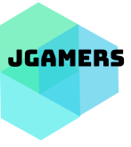

# Meu-site
Aqui postarei meus códigos do projeto de Programação Básica para Web
Aqui começo o meu projeto. Nesse primeiro momento, irei fazer só o html básicao. Botar os Navs., H1, H2's, 
's, o footer e etc...

Coloquei os links dos jogos que vou falar e um pouco sobre eles.

Botei também o conteúdo.
-----------------------------------------------------------------------------
2° edit: 
Aqui deixei melhor a visualização do código.
Dividi o conteúdo com sections e divs, onde por meio das classes ficará mais fácil pra por o CSS futuramente.
Divide o conteúdo nos articles, coloquei as targets nos links navegaveis.
Inclui a lingaguem e o meta no inicio do código para ficar melhor o entendimento do navegador.
2° edit em cima ->
---------------------------------------------------------------------------------------
3edit ->
Aqui já é o código HTML com CSS inserido externamente.
Fiz algumas alterações no código quanto a classe e divs.
Inseri uma img da logo que nos próximos passos vou ta melhorando ela ou possivelmente até trocando ela.

<!DOCTYPE html>
<html>
<head>
	<html lang="pt-br">
	<meta charset="utf-8">
	<title>Trabalho</title>
</head>
<link rel="stylesheet" type="text/css" href="estilo.css" />
<link rel="stylesheet" type="text/css" href="normalize.css" />
<body>
<!--Será a barra de navegação horizontal do site-->
	<nav>
		<ul>
			<li><a href="https://br.crossfire.z8games.com/" target="_blank" >CrossFire AL</a></li>
			<li><a href="https://rainbow6.ubisoft.com/siege/pt-br/home/index.aspx" target="_blank">Rainbow Six Siege</a></li>
			<li><a href="https://www.runescape.com/community" target="_blank">RuneScape</a></li>
			<li><a href="https://signup.br.leagueoflegends.com/pt/signup/index" target="_blank">League of Legends</a></li>
			<li><a href="#">Formulário</a></li>
		</ul>
	</nav>
	<!-- Daqui pra baixo é o conteúdo do site.
	*Lembrando que falta organizar todo o código. 
	*Por as sections, articles, divs, class e etc...-->
	<header class="titulo">
		<h1>JGamers</h1>
	</header>
	

		<section class="intro">
			<header class="cabecalho2">
				<h2>Conhecendo o mundo dos jogos</h2>
			</header>
			<article>
				
A história dos jogos digitais teve início quando os acadêmicos começaram a projetar jogos simples, simuladores e programas de inteligência artificial, como parte de suas pesquisas em ciência da computação. Somente a partir das décadas de 1970 e 1980 é que os jogos eletrônicos se tornaram populares, quando jogos de arcade, console de jogos eletrônicos e jogos de computador foram introduzidos ao público em geral. Desde então, os jogos eletrônicos tornaram-se uma forma popular de entretenimento e uma parte da cultura moderna em diversas regiões do mundo.

				
E é bem verdade que, nos últimos anos, cada vez menos pessoas compartilham o senso comum de que jogar videogames é um assunto restrito para os nerds ou para o público infanto-juvenil. Mas são em eventos como na <b>Brasil Game Show (BGS)</b> que se constata a força e o alcance do mercado dos jogos digitais. A seguir conheceremos um pouco mais dos jogos que nosso site acompanha:

			</article>
		</section>
	

	<header class="cabecalho3">
		<h2>Jogos do momento:</h2>
	</header>
	<section class="conteudo">
		<article>
			<h3>CrossFire AL</h3>
				
CROSSFIRE é um <abbr title="First Person Shooter">FPS</abbr> online gratuito baseado em duas forças mercenárias, Global Risk e Black List, que estão em um conflito global épico. Os jogadores têm ao seu dispor um enorme arsenal de armas de fogo realistas, explosivos, armas brancas e proteções utilizados pelas forças militares do mundo todo. Com modos de jogo variados e cenários únicos e repletos de ação, os jogadores devem trabalhar em conjunto para completar objetivos e ganhar experiência.

			<h3>RuneScape</h3>
				
Um <abbr title="Multijogadores Massivos Online">MMO</abbr> único ambientado no vasto mundo de fantasia de Guilenor, repleto de raças únicas, guildas e deuses antigos lutando pelo domínio. O RuneScape agora conta com novas formas de jogar, novas habilidades e mais de 200 missões com histórias emocionantes.

			<h3>League of Legends</h3>
				
Independentemente de você jogar solo ou com amigos, League of Legends é um jogo acelerado, estratégico e altamente competitivo desenvolvido para quem gosta de vitórias suadas.

			<h3>Rainbow Six Siege</h3>
				
Suba como o sol ardente no horizonte com Operation Ember Rise. Não perca nem um minuto sequer para subir até o topo com Amaru e seu Gancho Garra. Desacelere as coisas e incendeie seus inimigos com Goyo e seu Escudo Volcán.

		</article>
	</section>
	<!--o rodapé ficará aqui em baixo com dados dos criadores-->
	<footer>
		
Todos os direitos reservados

	</footer>
</body>
</html>
